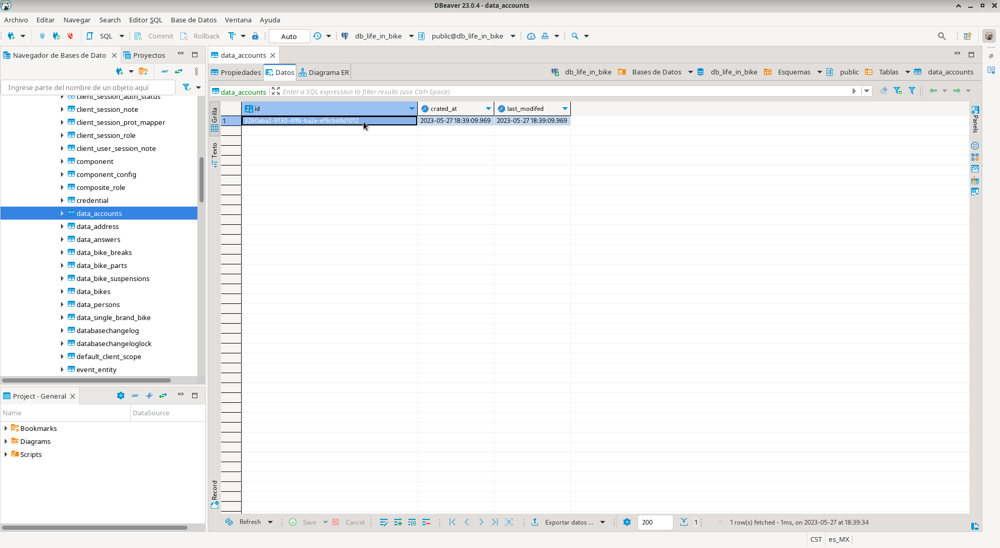
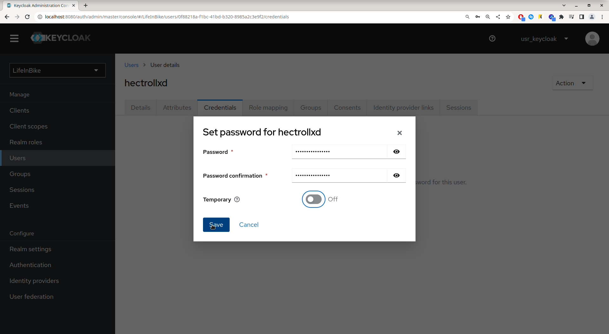
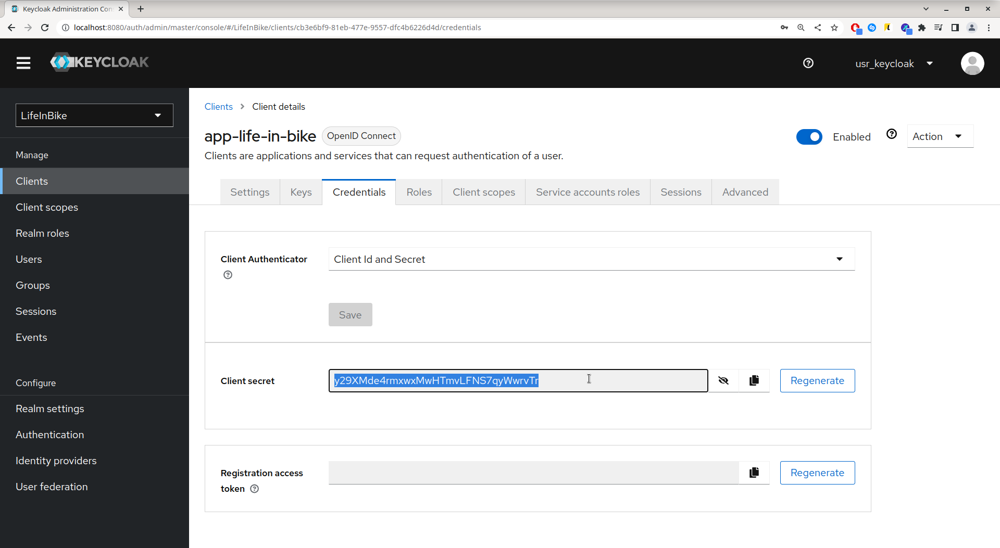
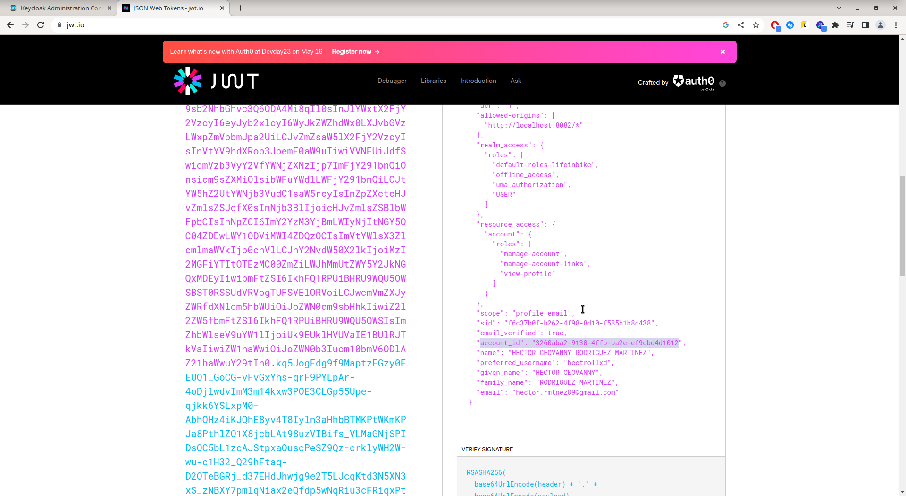

# Life in ~BIKE~ (Backend)
Documentación sobre el backend de la aplicación de Life in ~BIKE~.

## Requerimientos y consejos para ejecutar el proyecto.
**NOTA:** Esta documentación está basada bajo comando de linux. A su vez, los comandos pertenecen
totalmente a las distribuciones basadas en Arch linux.  
Si el proyecto se desa correr bajo otra distribución, será necesario buscar los comandos
correspondientes para esa distribución.

Requerimientos opcionales:
* Correrse bajo una distribución linux (preferentemente una basada en Arch).
* Uso del SGDB de PostgreSQL.

Requerimientos necesarios:
* OpenJDK 17.
* Procesador de 2 núcleos mayor a 1.8 GHz.
* 4 GB de RAM DDR3 a 1333 MHz o mayor.
* Almacenamiento mayor a 128 GB.

## Instalación del openJDK 17.
* Archlinux:   
    Actualizar los repositorios.
    ``` console
    # pacman -Syu
    ```
    Instalar el openjdk 17:
    ``` console
    # pacman -S jdk17-openjdk jre17-openjdk jre17-openjdk-headless
    ```
    En caso que ya se tenga una versión de java instalado, verificar que se esté usando la versión 17:
    ``` console
    $ java --version
    ```
    Si la versión que esta muestre no es la 17, se deberá de seleccionar esa versión. Para ello,
    será necesario ejecutar los siguientes comandos:
    ``` console
    # archlinux-java status
    ```
    El comando anterior deberá de mostrar las versiones de java instaladas:
    ``` console
    Available Java environments:
        java-17-openjdk
        java-19-openjdk (default)
        java-8-openjdk/jre
    ```
    Esta mostrará con una etiqueta ```(default)``` la versión que está seleccionada por defecto.   
    Para este caso, será necesario cambiarla a la versión del jdk 17. Para ello, se deberá de
    ejecutar el comando ```archlinux-java set <jdk>```, remplazando la etiqueta ```<jdk>``` por el
    nombre del jdk a utilizar de la lista de versiones instaladas. En este casó sería así:
    ``` console
    # archlinux-java set java-17-openjdk
    ```
    Y se corrobora nuevamente la versión con el comando ```java --version```.

## Instalación de docker.
Docker se utilizará como contenedor de base de datos y del servidor de Keycloak.
Esto es necesario para no depender de un servidor externo que nos provea el servicio de bases de
datos y, a su vez, montar el servidor de seguridad respecto a las cuentas; esto para que el proyecto
pueda ser ejecutado desde cualquier máquina con las herramientas necesarias.

* Archlinux:   
    Se deberá de instalar el paquete de docker:
    ```console
    # pacman -S docker docker-compose
    ```
    **Nota**: es necesario reiniciar una vez se haya instalado docker.   
    Posterior a esto, se deberá habilitar el srvicio de docker:
    ```console
    # systemctl start docker.service
    # systemctl enable docker.service
    ```
    En caso que al momento de intentar levantar el servicio de docker nos de un error; puedes
    ingresar a éste [link](https://bbs.archlinux.org/viewtopic.php?id=194087) y seguir los pasos
    que se indican (recuerda que debes de reiniciar tu equipo).

## Levantar el proyecto.
### Habilitar el contenedor de docker para PostgreSQL y Keycloak.

Para habilitar el contenedor de docker, se realizó un archivo llamado ```docker-compose.yml```, el 
cual contiene la información necesaria para el contenedor.   
Este archivo está localizado en la ruta raíz del proyecto, por lo que se deberá navergar hasta la
ruta del proyecto y ejecutar los pasos correspondientes:
* Archlinux:   
    Crear el contenedor de docker en base al archivo ```docker-compose.yml```:
    ``` console
    # docker-compose -f ./docker-compose.yml up -d
    ```

    En caso que ya se hubiera creado el contenedor y se requiera levantar el docker, solo es
    necesario correr el siguiente comando:
    ``` console
    # docker-compose up
    ```

### Correr los test
El testeo es necesario para corroborar que si se tenga conexión a la base de datos desde el
proyecto; así como realizar insersiónes y selecciones de datos de manera automática para comprobar
que las tablas están creadas de manera adecuada y la base de datos está preparada para el proyecto.
Para ejecutar los test será necesario realizar el siguiente comando:
``` console
$ ./mvnw test
```

**Nota:** Es necesario correr los test una vez se crea la base de datos y solo si la la base de
datos no tiene información guardada acerca de las cuentas. En dado caso que ya se tenga una cuenta
registrada, por ningún motivo se deberá de correr el test, ya que no lo pasará debido a los datos
repetidos en las columnas.

### Configurar Keycloak para su uso.
**Nota 1:** Se deben de tener los datos de cuentas como mínimo en la base de datos para que sea
posible crear los usuarios corespondientes a dicha cuenta desde keycloak (los test insertan uno de
manera automática, solo es necesario obtener el ID de la cuenta con un visualizador de bases de
datos como lo es DBeaver o DbVisualizer).

**Nota 2:** El docker debe de estar corriendo para realizar los siguientes pasos.

* Crear Realm de Keycloak:   
    Para ello deberás ingresar a la página de keyclocak desde el siguiente
    [link](http://localhost:8080/auth/) y presionarás la opción de "Administration console".
    
    Posteriormente se colocarán las credenciales que están en el acrhivo ```.env``` ubicado en la
    raíz del proyecto; las cuales están llamadas como ```KEYCLOAK_USER``` para el nombre del usuario
    y ```KEYCLOAK_PASS``` para la contraseña.
    
    Una vez dentro, nos iremos a la parte del dropdown nombrado "Master" y procedemos a crear el
    nuevo realm.
    
    Cuando estemos en la parte para colocar los datos del realm, le diremos que deseamos buscar un 
    archivo tipo ```.json``` con la configuración establecida. Dicho archivo está llamado
    ```LifeInBikeRealm.json``` ubicado en la ruta raíz del proyecto.
    
    Ya que se cargó la configuración del archivo se crea el realm.
    
* Crear usuarios:
    Para crear los usuarios, nos dirigimos a la parte llamada "Users" que se encuentra en el
    siderbar izquierdo y clickeamos el botón de crar nuevo usuario.
    
    Una vez que se despliega la pantalla para colocar la información del usuario, se deberá de
    colocar los datos del usuario que se desea crear y deberá quedar de la siguiente manera y lo
    cramos:
    
    Posteriormente, es necesario agregar el ID de la cuenta a la que pertenecerá el usuario.   
    Para ello, se deberá utilizar un visualizador de bases de datos y colocar los datos de
    conexión que se encuentran el el archivo ```.env``` localizado en la ruta raíz.
    Para ello, el host deberá quedar apuntando a localhost (127.0.0.1) y por el puerto 5432 (puerto
    por defecto de PostgreSQL).   
    Una vez que se logró establecer la comunicación con el SGDB de PostgreSQL, nos vamos a la tabla
    llamada ```data_accounts``` y copeamos el ID autogenerado de la cuenta resultante despúes de
    correr el test:
    
    Una vez que obtenemos el ID autogenerado, nos iremos a Keycloack, nos metemos al usuario que
    deseamos asignarle esa cuenta y en la opción de "Attributes" localizado en la parte inferior del
    nombre del usuario. En el campo llamado "Key" colocamos "account_id" y en el campo llamado
    "Value" colocamos el ID de la cuenta que obtuvimos de la base de datos.
    
    Acto seguido, nos vamos al apartado "Credentials" del usuario y le seteamos una contraseña
    (es sumamente importante que el switch de "Temporary" esté desactivado).
    
* Obtener la contraseña del cliente.
    Es importante obtener las credenciales del cliente para que sea posible las peticiones de 
    tokens de autorización para las consultas a los endpoints. Para ello, nos deberemos de ir a la
    opción de "Clients" ubicado en el siderbar izquierdo; después seleccionaremos el cliente llamado
    "app-life-in-bike" y nos vamos al apartado llamado credentials.   
    Una vez que estemos en esa parte, será necesario seleccionar el botón "Regenerate" para crear
    el nuevo client secret.
    
    Una vez generado, copeamos la clave para realizar una prueba en postman y obtener un access
    token.
    
    Ya que se obtiene el la clave del cliente, nos dirigimos a postman y realizamos una nueva 
    consulta de tipo POST destinado al url ``` ```. En el apartado de body, de diremos que será de
    tipo ```x-www-form-urlencoded``` y agregamos los campos de client_id, el cual tendrá como valor
    el nombre del cliente "app-life-in-bike". El campo client_secret deberá tener como valor la
    clave generada en el paso anterior. En el campo username y password deberá de tener los valores
    de algún usuario registrado (en este caso el usuario hectrollxd y su respectiva contraseña que
    se le colocó en pasos anteriores). Y en el campo grant_type, solo se le define el tipo de
    autenticación a utilizar para obtener el token.   
    La petición deberá de verse similar a la siguiente imágen y este deberá de responder con el
    access token:
    
    Y por último (opcional), se corrobora el access token obtenido desde la página
    [jwt.io](https://jwt.io/) solo para validar que sí está presente el campo de account_id:
    


### Correr el proyecto
Para esto, es necesario estar en la ruta raíz del proyecto y ejecutar el siguiente comando:
``` console
$ ./mvnw spring-boot:run
```

### Acceder a la documentación del api.
En esta parte se podrá encontrar la documentación de absolutamente todos los endpoints del proyeco.
Esto nos facilita la visualización de todos los endpoints disponibles, la forma en la que se
utilizan, que atributos recibe y su retorno.   
Para ello deberá de estar corriendo el proyecto y entrar al siguiente link
[swagger-ui](http://localhost:8080/swagger-ui.html)

## Bajar el proyecto.
### Deshabilitar el contenedor de docker.
**Nota**: Si se está usando un servidor de bases de datos externo, se puede omitir este paso.
* Archlinux:   
    Para deshabilitar el contenedor, se deberán ejecutar los siguientes comandos:
    ``` console
    # docker-compose down
    # docker-compose stop
    ```
    Y para asegurarnos que se deshabilito correctamente, se deberá de corroborar con el comando:
    ```console
    # docker-compose ps
    ```
